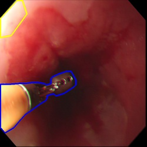

# EAD2019 Challenge

#### About:
Endoscopic Artefact Detection (EAD) is a core challenge in facilitating diagnosis and treatment of diseases in hollow organs. Precise detection of specific artefacts like pixel saturations, motion blur, specular reflections, bubbles and debris is essential for high-quality frame restoration and is crucial for realising reliable computer-assisted tools for improved patient care. The challenge is sub-divided into three tasks: 

- Multi-class artefact detection: Localization of bounding boxes and class labels for 7  artefact classes for given frames.
- Region segmentation: Precise boundary delineation of detected artefacts. 
- Detection generalization: Detection performance independent of specific data type and source.

**Checkout the updates of this challenge here:** [EAD2019-Challenge](https://ead2019.grand-challenge.org/EAD2019)

#### What you will find here?

- [annotation file format converters](https://github.com/sharibox/EAD2019/tree/master/fileFormatConverters)

- [test script](https://github.com/sharibox/EAD2019/tree/master/scripts) 

- [configuring your training images and annotations](https://github.com/sharibox/EAD2019/tree/master/annotationImages_and_labels) 

- [detection evaluation: mAP and IoU](https://github.com/sharibox/EAD2019/tree/master/evaluation_mAP-IoU)

- [via to mask image converted](https://github.com/sharibox/EAD2019/blob/master/jsonViaAnnotation_maskImage.py)

- [semantic evaluation: DICE-JACCARD](https://github.com/sharibox/EAD2019/tree/master/evaluation_semantic)

#### Artefact detection

- 7 classes for artefact detection. Below shows the distribution of samples in each artefact class. 

#### Semantic segmentation (New)

 - For semantic segmentation we use only 5 classes ``{'Instrument', 'Specularity', 'Artefact' , 'Bubbles' and 'Saturation'}``

    

 
 

